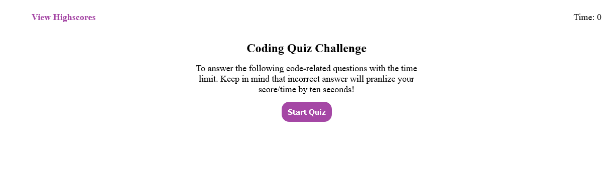
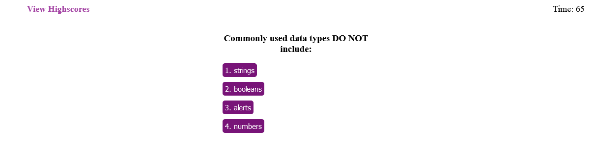
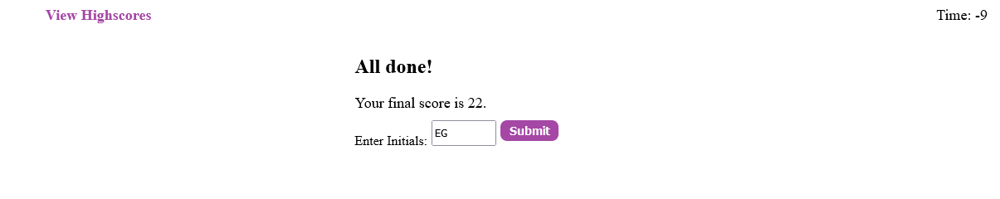
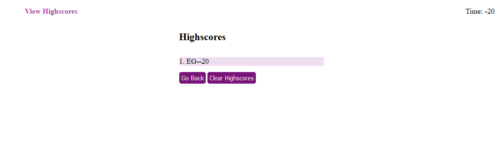

# Introduction:

Coding Quiz application powered by JavaScript with clean code. You can answer to questions in limited time and test your skills. It provides multiple choice questions with limited time. All you have to do is to choose the right answer.

Upon correct/incorrect answer you will be prompted about it with correct/wrong.

## Developer Insights:

I am thankful to my instructors at RutgersCodingBootcamp, that they teach me so well and I have crated this coding application.

## Resources:

-   [W3SCHOOLS.COM](https://www.w3schools.com/jsref/met_win_prompt.asp)
-   [Strings Concatenation](https://www.w3schools.com/jsref/jsref_concat_string.asp)
-   [MDN](https://developer.mozilla.org/en-US/docs/Web/JavaScript)

## Screenshots

Home Page:

Quiz Page:

Quiz Completed:

Scoring:

